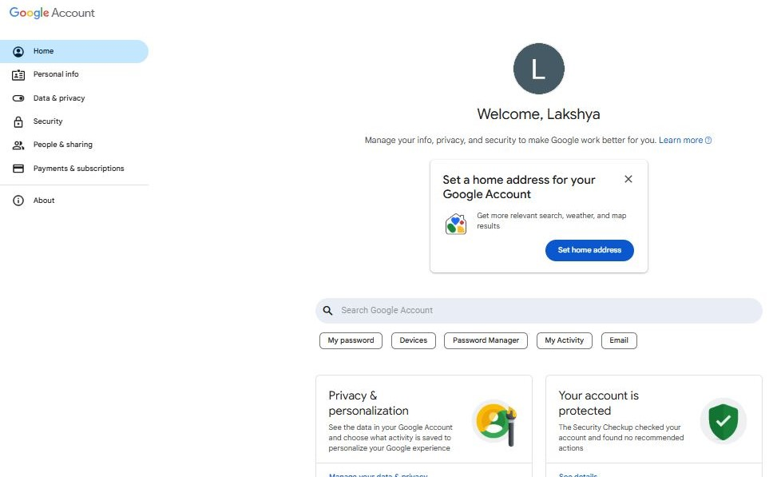
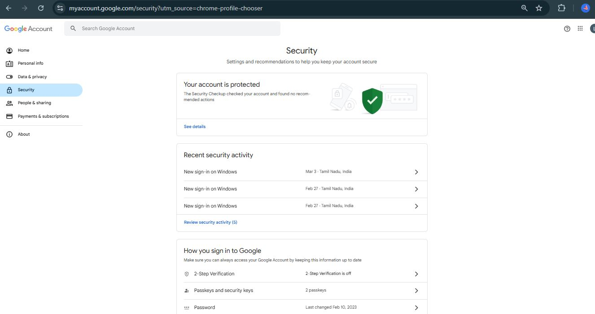
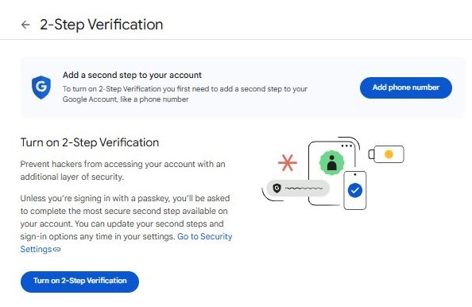
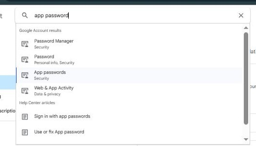
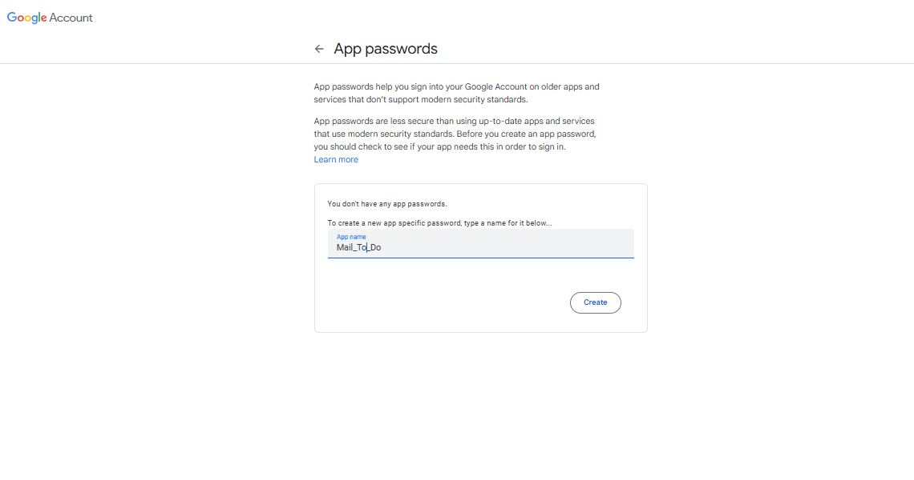
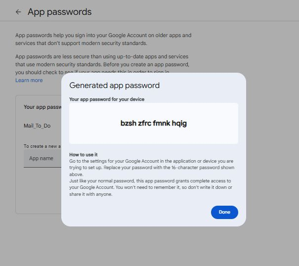
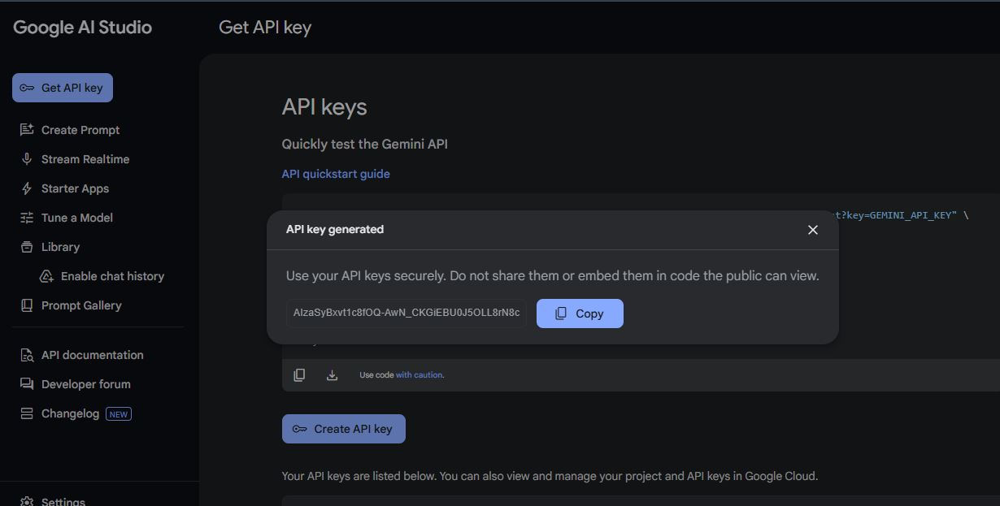

# ⚡️ Quick Overview

**Email-to-do_AI** is a Chrome extension that leverages Google APIs and Gemini AI to automatically extract actionable tasks from your Gmail inbox. It streamlines your workflow by converting email content into a categorized to-do list, helping you manage tasks directly from Gmail.

---

## 🏗️ Features

- **Automatic Task Extraction:** Uses AI to identify and extract tasks, deadlines, and summaries from emails.
- **Categorized To-Do List:** Tasks are split into "In Progress" and "Completed" sections for easy tracking.
- **Secure Credential Storage:** All sensitive information (email, app password, API key) is stored securely in Chrome's local storage.
- **User-Friendly Interface:** Integrated checklist icon in Gmail for quick access.
- **Manual Task Management:** Mark tasks as completed or pending with a single click.
- **Error Handling:** Built-in debugging support via Chrome DevTools.

---

## 🛠️ Requirements

- **Google Account** with App Password enabled.
- **Gemini AI API Key** from Google AI Studio.
- **Google Chrome** (latest version recommended).
- **VS Code** or any code editor for setup and development.

---

## 📦 Project Structure

```
/Email-to-do_AI
│
├── manifest.json         # Chrome extension manifest
├── background.js         # Handles background processes
├── content.js            # Injects scripts into Gmail
├── popup.js              # Manages popup UI and logic
├── assets/               # Images and screenshots for documentation
├── styles/               # CSS files for extension UI
└── README.md             # Project documentation
```

---

## 🧠 How AI Extraction Works

- The extension scans the visible emails in your Gmail inbox.
- Gemini AI processes the email content to extract:
    - Task descriptions
    - Deadlines or due dates
    - Sender and subject
    - Summaries or key points
- Extracted tasks are displayed in a structured checklist for easy management.

---

## 🛡️ Security & Privacy

- Credentials are stored only in your browser's local storage.
- No data is sent to third-party servers except for Gemini AI API calls.
- You can clear or update your credentials anytime via the extension popup.

---

## 💡 Tips

- For best results, enable Two-Step Verification on your Google Account.
- Regularly update your extension for new features and security patches.
- Use the checklist to keep track of both personal and work-related tasks extracted from emails.

---
# 📧 Email-to-do_AI ✅  
This **Chrome extension** enhances **email productivity** by extracting key details from emails and automatically generating a **structured to-do list**. It helps users **stay organized** by identifying important tasks directly from their inbox.  

---


## 🚀 Steps to Run the Chrome Extension  

### 1️⃣ Set Up the Project in VS Code  
- Open **VS Code** and navigate to your extension’s project folder.  
- Ensure you have saved all the required files needed for the extension to function properly.  

---

### 2️⃣ Load the Extension in Chrome  
1. 🌐 Open **Google Chrome**  
2. 🔗 Open [Chrome Extensions Page](chrome://extensions/) in the address bar.  
3. ⚙️ Enable **Developer Mode** (toggle switch at the top right).  
4. 📂 Click **Load Unpacked**  
5. 🗂️ Select your project folder  
6. ✅ Your extension will be loaded, and you should see its **icon in the Chrome toolbar**.  

---

### 3️⃣ Set Up API Keys & App Passwords  
🔐 **Click the extension icon → Enter:**  
- ✉️ **Email Address**  
- 🔑 **Google App Password** (generated from [Google Account Security](https://myaccount.google.com/apppasswords))  

🛠 **How to create a Google App Password?**  
1. Navigate to your Google Account → **Manage your Google Account**.  
     
2. 🔍 On the right side of the Account page, open **Security**.  
        
3. ✅ In the **Security** page, if **Two-Step Verification** is not enabled, **turn it on**.  
      
4. 🔎 Search for **App Passwords** and open it.  
     
5. 🏷️ In **App Passwords**, create an app name (e.g., `Mail_To_Do`).  
       
6. 🆕 Once the app name is created, your **App Password** will be generated. Use this for authentication.  
      

- 🤖 **Gemini AI API Key**  
   - Get your **Gemini AI API Key** from [Google AI Studio](https://aistudio.google.com/).  
   - Use this **API Key** for authentication.  
       

📌 These details are **stored securely in local storage** and used for extracting email details.  

---

### 4️⃣ Testing the Extension in Gmail  
- 📧 Open **[Gmail](https://mail.google.com/)**  
- ✅ Look for the **checklist icon** on the Gmail page.  
- 📝 Click the icon → The extension will scan emails and display a **To-Do List** categorized into:  
  - [ ] **In Progress** (Pending Tasks) – Tasks that need to be completed.  
  - [x] **Completed** (Finished Tasks) – Once a task is done, you can mark it as completed by checking the box.  

---

### 5️⃣ Debugging Issues (If Needed)  
- 🛠️ Open Chrome DevTools (`Ctrl + Shift + I` / `Cmd + Option + I`)  
- 📜 Go to the **Console** tab → Check for errors in `background.js`, `content.js`, or `popup.js`.  
- 🔄 If the extension doesn’t load, go to `chrome://extensions/`, click **Reload**.  

---

## 🔍 How the Chrome Extension Works?  
✅ A **checklist icon** appears in Gmail after installing the extension.  
✅ Clicking the icon asks for:  
  - 📩 **Email**  
  - 🔑 **App Password**  
  - 🔐 **API Key**  
*(Stored securely in local storage)*  

---

## 📋 To-Do List Structure  
### 📝 Tasks  
Tasks are displayed in two sections:  
1. **In Progress** – 🚧 Pending tasks  
2. **Completed** – ✅ Finished tasks  

---
<<<<<<< HEAD
=======

### 📤 Extracted Email Details  
The tasks are **extracted from emails**, including:  
📌 **Subject**: Email subject line  
📌 **Sender**: Name or email address  
📌 **Date**: When received  
📌 **Summary**: Brief key details  
📌 **Due Date**: Any mentioned deadline  

---